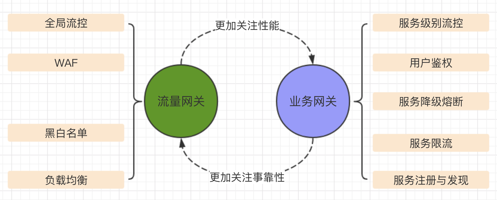
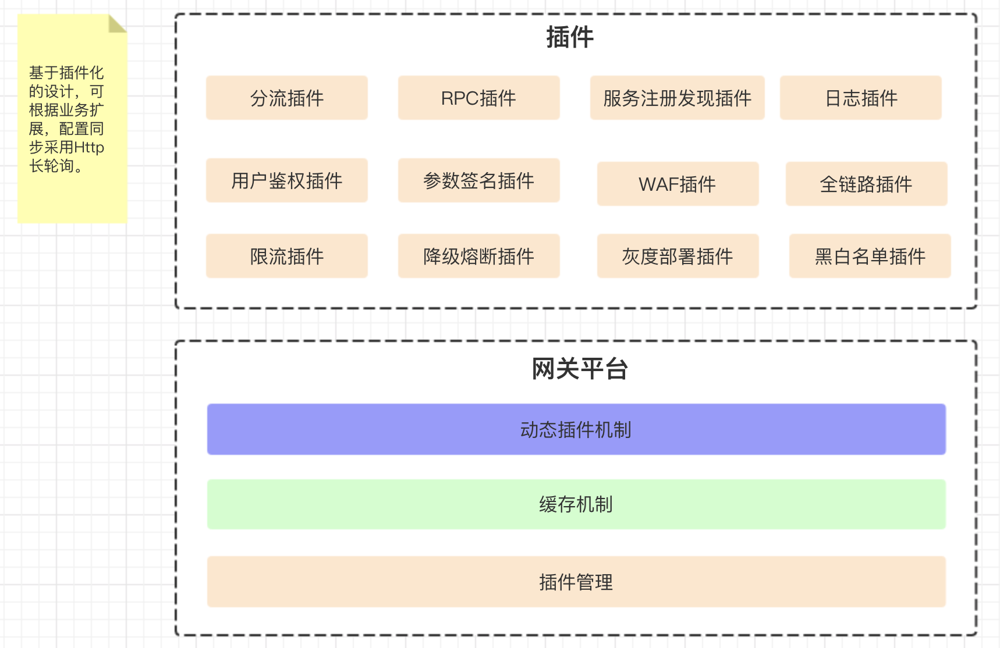
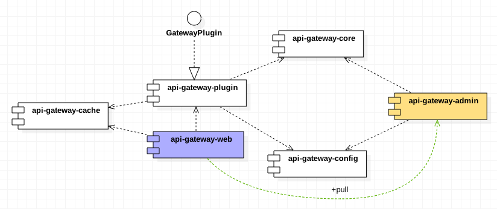
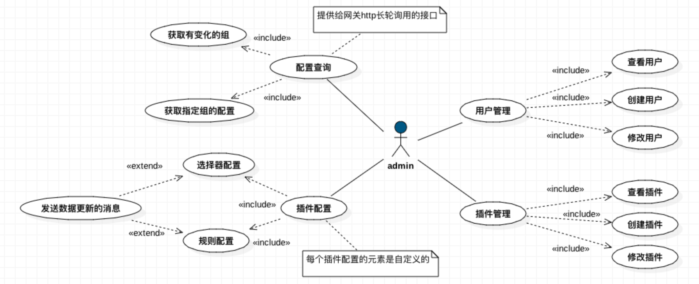
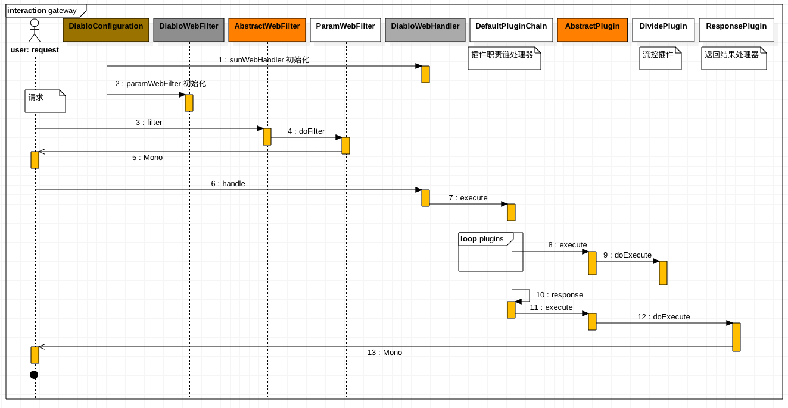
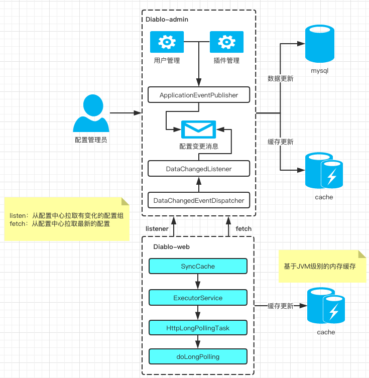

# 业务网关方案

## 背景

1、基于服务的流控需求越来越重要，流量类网关(Nginx)无法满足

2、团队责任分工越来越细后，后端的服务面临拆分，需要有网关解决通用问题，释放重复的劳动力。

## 技术方案

### 技术栈

1、spring webflux

2、webclient

> 项目是借鉴了[soul网关开源项目](https://github.com/Dromara/soul)，其中后台部分拿过来扩展一些功能，网关项目借鉴了思路重新进行了针对性的整合

### 网关种类及定义

+ 流量网关由Nginx充当
+ 业务网关是服务层面的，着重点是服务的可靠性

### 服务网关功能

1、接口流控

> 对接已经封装好的sentinel，即可动态对接口进行必要的控制，确保服务稳定

2、鉴权控制

> 比如用户是否登录等

3、灰度分流控制

> 之前依赖nginx做服务请求的分流，可将后端服务的灰度流控逻辑下沉到服务网关

4、安全控制

> 比如数据签名，防刷之类

5、服务监控

> cat埋点，请求全链路跟踪的traceId管理等

6、路由管理

> 需要支持动态路由以及路由数据的持久化

### 组件图

### 后台用例图

### 请求时序图

### 缓存方案

> 采用长轮询方式将后台的配置同步网关进程内，为了访问的高效以及简单，缓存存储采用JVM内存缓存支持。

## 网关协议转换

通过rpc泛化的方式将dubbo服务以http方式接入网关。

### 前端调用约定

+ 请求头增加rpcType，dubbo
+ QueryString中增加apiInterface参数

# 业务网关系列文章

## 使用场景

## 设计理念

## 实现

## 响应式

### 插件

+ 分流插件

+ 协议转换插件

+ 黑白名单插件

+ 限流插件

+ [鉴权插件](docs/鉴权插件.md)

+ 签名插件

## 后台管理

## 遇到过的问题

+ 日志量过大导致load值尖峰

+ 服务部署时出现异常日志

