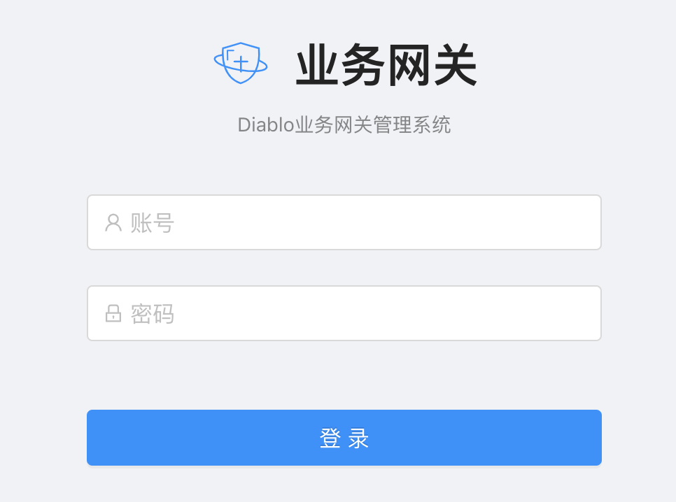
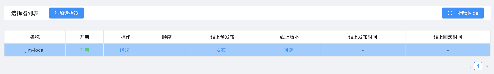
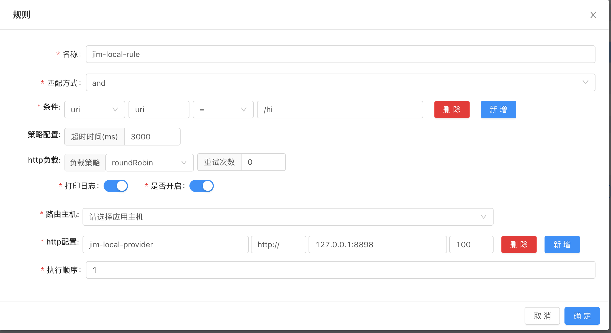

# 操作手册

这里从部署运维的角度描述如何将网关系统动作起来，由于线上实战的系统是分布式，所以项目依赖的组件会相对多一些，为了简化，将配置组件（apollp）做了移除。这篇以网关最基本的分流组件做为演示，其它组件的应用不在此篇中描述。

## 依赖组件

### 基础组件

以下组件需要提前安装好，本地跑的话建议用docker跑。

1、redis

> 用于缓存数据

2、zookeeper

> 用于在分布式系统中同步数据

3、mysql

> 用于存储网类的配置数据，比如分流规则，RPC协议转换等数据。

### 应用组件

以下组件是基于应用层面的应用软件，更好的处理业务中的问题。

1、缓存

> 引入了jetcache做为项目中缓存组件，支持多级缓存

2、限流

> 引入了sentinel处理限流、熔断

## 后台系统

后台系统也可以理解成一个配置系统，针对不同的网关插件做不同的数据配置。实战版本中有预发环境以及生产环境，但本地跑起来可以只选用预发环境就可以。

> 后台系统的代码70%来自于开源项目[soul]，我们在此基础上做了一些扩展性的功能，比如：预发环境下生产环境；RPC协议插件配置；分布系统数据同步等。

1、创建数据库:diablo_pre

2、执行diabol-admin项目中scripts目录下的diablo_pre.sql，创建表结果以及初始化数据

3、修改application.yml，按实际情况修改对应的mysql,redis,zookeeper等配置

4、指定预发环境标识

> 启动参数中配置diablo.admin.apollo.cluster=pre；此处的key名称后续会更改。

5、启动项目

> 启动成功后，浏览器输入:http://127.0.0.1:8887 即可看到后台登录页面

6、配置分流插件

配置流量选择器，实战中我们是以域名做为维护，有点类似nginx中监听的域名；分流插件第一步是在预发环境中配置，测试通过后同步到线上，同步后如果有问题提供了回滚功能。

配置流量选择器后面的分流规则，有点类似nginx中的location配置；具体的分流规则可以将线上的请求跑由到后端的做任意服务上。

上图中有一栏是路由主机选择，比如将/order开头的请求路由到order-api服务，我们可以通过接口形式将order-api后端服务器列表数据同步过来。

## 测试系统

由于我们主要是与分流插件为侧，就需要启动一个后端的用于测试的api项目，比如提供这样的接口：http://127.0.0.1:8898/hi?name=123456

## 网关系统

diablo-web启动比较简单，与一般的web项目没有大的差异。

1、配置application.yum；

2、启动网关系统；

3、测试转发能力

> 输入http://127.0.0.1:8899/hi?name=123，如能看到如下输入就说明分流插件运转正常。

