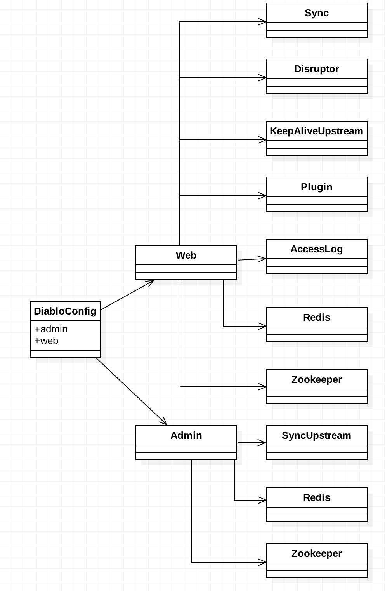

# 配置类图

将项目中的配置聚合在一起，便于管理。

## 设计

下面是整理之后的与配置相关的数据对象关系图，主要分为后台管理以及网关配置相关。



## 实现

spring对于属性的注入方面主要有以下2种方式：

+ 单一属性方式，@Value

+ 批量属性方式，@ConfigurationProperties

上面2种方式各有特点

|     |@Value  |@ConfigurationProperties|
|  ----  | ----  |----  |
| 功能  | 单一属性配置 |批量属性配置 |
| 是否支持松散绑定  | 不支持 |支持|
| 是否支持SPEL  | 支持 |不支持|
| 是否支持JSR303  | 不支持 |支持|
| 是否支持复杂类型  | 不支持 |支持|


diablo网关选择了批量属性方式，以对象的方式呈现配置。主要为是后台管理相关配置以及网关相关配置，然后还有一些公共的中间件相关的配置：redis,zookeeper,apollo等。

1、配置入口：DiabloConfig

创建一个DiabloConfig的类，解释下类上面的注解：

+ @Data，这是一个语法糖，用来生成属性的get,set方法
+ @Configuration，表明这是一个配置类
+ @Component，表明这是一个组件，会在其它地方被注入依赖
+ @ConfigurationProperties，批量属性注入。

> prefix是指在application.yml中的属性前缀；ignoreInvalidFields是指当属性匹配发生错误时是否忽略，如果配置成false，有可能会抛错误。

```java


@Data
@Configuration
@Component("diabloConfig")
@ConfigurationProperties(prefix = "diablo",ignoreInvalidFields = true)
public class DiabloConfig implements Serializable {

    /**
     * 后台管理配置
     */
    private Admin admin;

    /**
     * 网关配置
     */
    private Web web;

}

```

2、application.yml ：配置上对应的属性值

```python

diablo:
  web:
    keepAliveUpstream:
      scanTimeMillisecond: 1000
    disruptor:
      bufferSize: 2048
      threadSize: 1
    accessLog:
      enable: true
      percentagy: 100
    redis:
      master: common
      nodes: 192.168.1.10:26379
      pwd: 123
    sync:
      strategy: http
      url: http://localhost:8887

```

3、使用

只需要在使用的地方注入上面的配置类组件即可开始工作。

```java

 @Autowired
 private DiabloConfig diabloConfig;

```

# 网关项目开源

以上内容基于业务网关的一个小模块，详细请看这里：[diablo在这里](https://github.com/ishansong-tech/diablo)