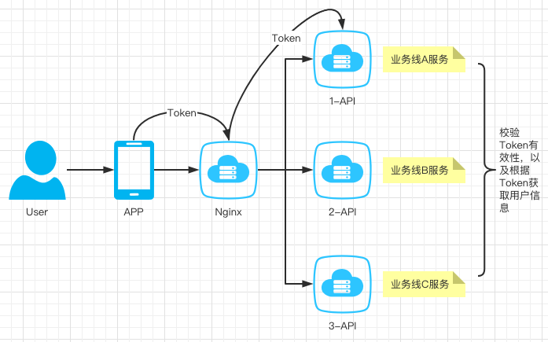
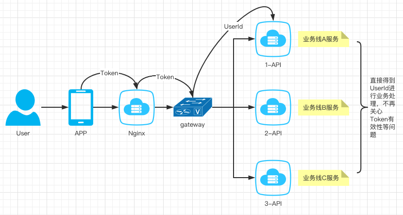
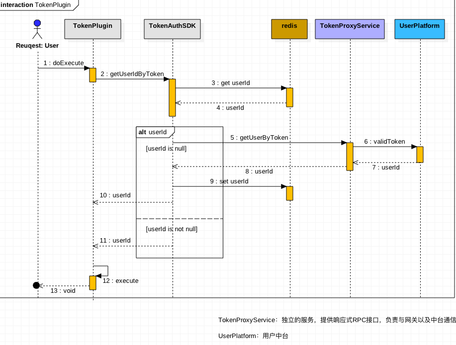

# 鉴权插件

鉴权一般分为2部分：

1、识别身份有效性

2、识别是否有权限

> 目前业务网关只解决第1部分，权限暂无应用。

## Token

来看一个场景，APP与服务端的交互过程，简略网络图。不同的公司可能会更复杂，比如有负载均衡等。

后端的业务api与app交互时需要识别身份，大多的做法是通过token，此时业务api需要处理如下事项：

1、判定app传过来的token是否存在

2、判定app传过来的token是否过期

3、根据token获取用户详细信息

问题：

如果一个app业务复杂，后端服务是由一堆相互隔离的服务组成，此时每个业务api均需要解决上面的3个问题，存在重复劳动。

优化方案：

将上面业务api需要做的事抽取到网关层，业务API只关心业务数据userId。

## Token插件实现方案

交互时序图：

核心逻辑在TokenAuthSDK,它需要完成没有业务网关时业务API做的事情，数据存储在redis的目的是为了高性能。这里未包含token失效的逻辑，不同的业务可能逻辑不同。